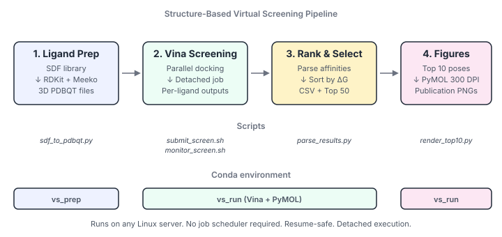

# Structure-Based Virtual Screening Pipeline

An end-to-end, reproducible pipeline for **structure-based virtual screening**
of large small-molecule libraries against a protein target using
[AutoDock Vina](https://vina.scripps.edu/). Designed for headless Linux
servers without a job scheduler: launch the screen, disconnect, come back
to ranked hits and publication-quality interaction figures.

<p align="center">
  
</p>

## What it does

```
Multi-compound SDF  ──►  3D PDBQT ligands  ──►  AutoDock Vina docking
                                                          │
                                                          ▼
     Publication figures  ◄──  Top-10 poses  ◄──  Ranked CSV (all + top-50)
```

1. **Prepares ligands** — RDKit + Meeko convert an SDF library
   (thousands to millions of compounds) into individual 3D PDBQT files,
   named by their catalog ID.
2. **Screens against a receptor** — AutoDock Vina docks every ligand into
   a user-defined binding pocket, in parallel, running detached so you
   can close your laptop.
3. **Ranks results** — parses every Vina output, writes a full CSV
   ranked by binding affinity, and isolates the top 50 hits.
4. **Renders publication figures** — PyMOL script produces 300 DPI PNGs
   of the top 10 poses with cartoon receptor, ligand sticks, and
   interacting residues automatically detected and labelled.

## Features

- **No job scheduler required.** Uses `nohup setsid` — survives SSH
  disconnect, terminal close, and laptop sleep.
- **Resume-safe.** Interrupted screens pick up where they left off.
- **Shared-server friendly.** Configurable CPU cap, `nice`/`ionice`
  defaults so other users' interactive work stays responsive.
- **Live monitoring.** `monitor_screen.sh` shows progress bar, throughput,
  and projected ETA at any time.
- **Reproducible.** Two conda environments (prep + screening) with pinned
  channels. Fixed random seeds throughout.
- **Publication-ready output.** PyMOL script produces PNGs suitable for
  manuscript figures at 300 DPI.

## Repository layout

```
.
├── README.md                     ← you are here
├── LICENSE                       ← MIT
├── CITATION.cff                  ← how to cite this pipeline
├── environments/
│   ├── vs_prep.yml               ← RDKit + Meeko env for ligand prep
│   └── vs_run.yml                ← Vina + Python for screening & parsing
├── scripts/
│   ├── sdf_to_pdbqt.py           ← 1. SDF → PDBQT batch converter
│   ├── vina_config.txt           ← Vina config template (edit for your target)
│   ├── submit_screen.sh          ← 2. Launch detached screen
│   ├── screen_worker.sh          ← Internal: the actual docking loop
│   ├── monitor_screen.sh         ← Live progress / ETA viewer
│   ├── stop_screen.sh            ← Cleanly stop a running screen
│   └── parse_results.py          ← 3. Rank all compounds; extract top-50
├── pymol/
│   ├── render_top10.py           ← 4. Publication-quality figures (3D PyMOL)
│   └── batch_render.sh           ← Convenience wrapper: render all 10 in one go
├── docs/
│   ├── QUICKSTART.md             ← 5-minute walkthrough
│   ├── PIPELINE.md               ← Detailed protocol
│   ├── FIGURE_GUIDE.md           ← PyMOL rendering options + customization
│   └── TROUBLESHOOTING.md
├── example_data/
│   ├── sample_library.sdf        ← 3 compounds from Enamine REAL
│   └── expected_output/          ← what a successful run looks like
└── figures/
    └── pipeline_overview.svg     ← the diagram in this README
```

## Quick start

**1. Setup (once)**

```bash
git clone https://github.com/Ali-jarvis/vs-pipeline.git
cd vs-pipeline

conda env create -f environments/vs_prep.yml
conda env create -f environments/vs_run.yml
```

**2. Prepare your ligand library**

```bash
conda activate vs_prep
python scripts/sdf_to_pdbqt.py library.sdf -o pdbqt_out -j 8
```

**3. Prepare receptor + configure Vina box**

```bash
mk_prepare_receptor.py -i receptor.pdb -o receptor.pdbqt -p
# then edit scripts/vina_config.txt: set receptor + box center/size
```

**4. Launch the screen (detached — close your laptop)**

```bash
conda activate vs_run
cd scripts/
chmod +x *.sh
./submit_screen.sh --check         # verify CPU plan
./submit_screen.sh                 # go — safe to disconnect after this
```

**5. Monitor whenever you want**

```bash
./monitor_screen.sh -w             # live progress + ETA
```

**6. Rank and get top hits**

```bash
python parse_results.py --in-dir vina_out --top-n 50
# → screening_results.csv, top_hits/top50.csv, top_hits/rank*.pdbqt
```

**7. Render publication figures for the top 10**

```bash
cd ../pymol
./batch_render.sh                  # → figures/rank01_Z*.png ... rank10_Z*.png
```

Full walkthrough in [`docs/QUICKSTART.md`](docs/QUICKSTART.md).

## System requirements

- Linux server (tested on Ubuntu 22.04); macOS also works
- ~10 GB RAM minimum (100k-compound screens are CPU-bound, not memory-bound)
- Miniconda or Anaconda
- Optional: PyMOL for the figure rendering step (open-source
  `pymol-open-source` from conda-forge works fine)

## Timing

Rough per-ligand estimate (drug-like, ~5–8 rotatable bonds, exhaustiveness 8,
25 Å box):

| Library size | 8 CPUs   | 50 CPUs  | 124 CPUs |
| ------------ | -------- | -------- | -------- |
| 1,000        | ~3 h     | ~30 min  | ~15 min  |
| 10,000       | ~30 h    | ~5 h     | ~2 h     |
| 100,000      | ~13 days | ~50 h    | ~20 h    |

Actual throughput varies with box size, ligand flexibility, and receptor
size. Run a 500-compound smoke test first — after 30 minutes
`monitor_screen.sh` gives you a real ETA.

## Citing this pipeline

If you use this pipeline in published work, please cite:

- **AutoDock Vina 1.2** — Eberhardt, Santos-Martins, Tillack, Forli (2021). *J Chem Inf Model*.
- **Meeko** — Forli lab, Scripps (github.com/forlilab/Meeko).
- **RDKit** — RDKit: Open-source cheminformatics. https://www.rdkit.org
- **PyMOL** — The PyMOL Molecular Graphics System, Schrödinger, LLC.

And this repository — see [`CITATION.cff`](CITATION.cff) for a
machine-readable citation.

## License

MIT — see [`LICENSE`](LICENSE).

## Contributing

Issues and pull requests welcome. If you extend the pipeline (consensus
scoring, GNINA rescoring, MM-GBSA rescoring, alternative docking
backends), open a PR.

## Author

**Dr. Shahid Ali**  
Postdoctoral Fellow, School of Biology, Hunan University, Changsha, China  
Focus: computational biology, structure-based drug discovery, protein engineering

- ORCID: [0000-0002-4724-5086](https://orcid.org/0000-0002-4724-5086)
- Google Scholar: [scholar.google.com/citations?user=B3jovoIAAAAJ](https://scholar.google.com/citations?user=B3jovoIAAAAJ)
- Website: [drali.faculty.bio](https://drali.faculty.bio)
- GitHub: [@Ali-jarvis](https://github.com/Ali-jarvis)
